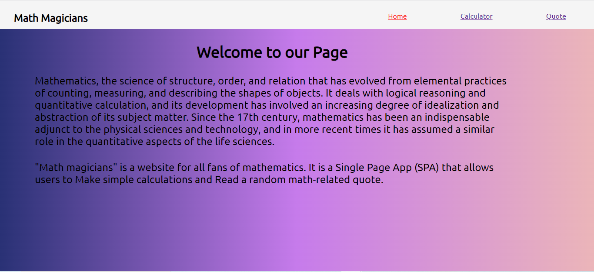
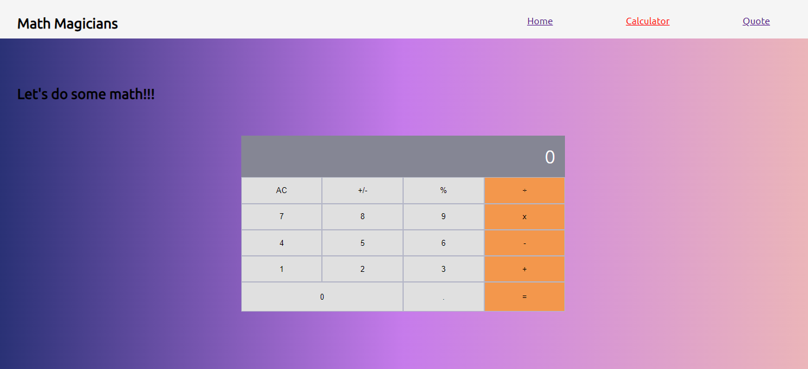
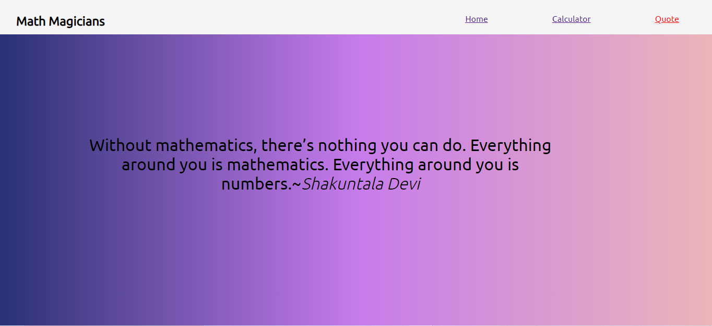

# Math-magicians

"Math magicians" is a website for all fans of mathematics. It is a Single Page App (SPA) that allows users to:

- Make simple Math calculations.
- Read a random math-related quote.

## Project screenshots

### Getting Started

- Create a Github repository.
- Clone the repository locally.
- Create a **develop** branch and push it to Github.
- Set the **develop** branch as the *defaut* branch on Github.
- Create a feature branch under the **develop** branch.
   
**In the new feature branch:**

- Create the react app 
  `npx create-react-app .`
- Set up the [linters]()
 

## Built With

*Major languages:* 
-  **Html5**
-  **Css3**
-  **JavaScript**
  
*Framework*

- **React.js**
  
*Technologies used:* 

- Github
- Git 
- Vscode

## Demo
Check out the [live version](https://chukwuemeka1234.github.io/math-magicians/) of the website for more details.

👤 **Author**

- GitHub: [@chukwuemeka1234](https://github.com/chukwuemeka1234)
- Twitter: [@avc_victor](https://twitter.com/@avc_victor)
- LinkedIn: [ani-chukwuemeka](https://linkedin.com/in/ani-chukwuemeka-a65421199/)
  
### Show your support
Give a ⭐️ if you like this project!

## 📝lICENSE

This project is [MIT](https://github.com/chukwuemeka1234/math-magicians/blob/develop/LICENSE) licensed.